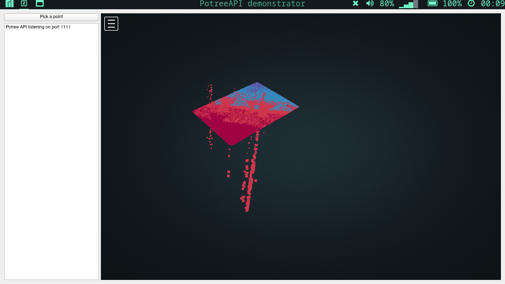
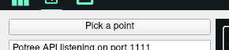
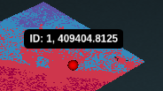
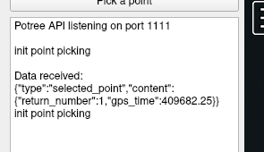

# User documentation
## How to use the demonstrator ?
Upon launch of the `demo` executable, the following interface pops up:

On the right-hand side, you have a fully fonctionnal Potree interface with a pointcloud already loaded. You can change the camera view using the mouse : the left click enables you to rotate and the right click to pan.

On the left-hand side, a button says "Pick a point":

If you click it, you'll be able to select a point by passing your mouse over :

As soon as you click, data will be send from Potree to the C++ code. It will be printed on the left in the dedicated area:

That's it !